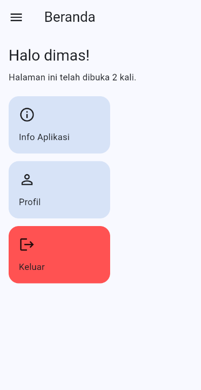
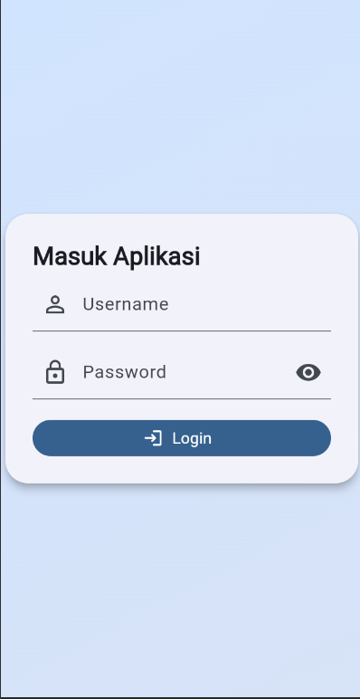
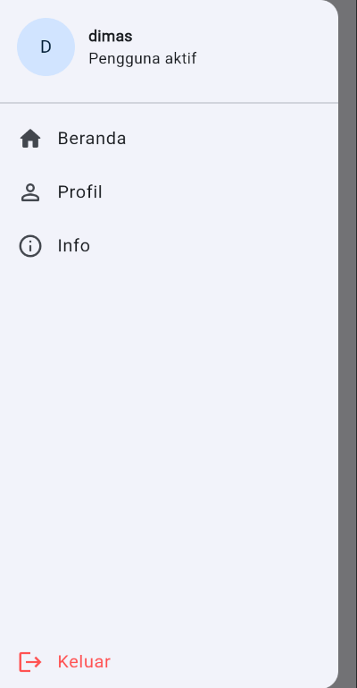
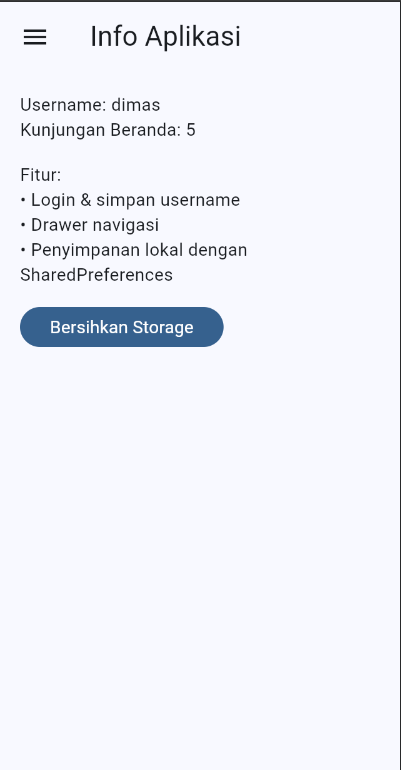

# Tugas 7 — Versi Sederhana (Halaman Tunggal Tanpa Subfolder)

### Fitur utama:

- Routing bernama sederhana: `/login`, `/home`, `/info`, `/profile`
- Login menyimpan `username` ke `SharedPreferences`
- Drawer untuk navigasi & logout
- Counter berapa kali halaman Home dibuka (`home_count`)
- Tombol bersihkan storage di halaman Info

### Screenshot

Letakkan cuplikan layar pada folder `docs/screenshots/` kemudian sesuaikan nama file bila perlu.







## Struktur Kode Baru

- `lib/main.dart` : Root `MaterialApp` + definisi routes.
- `lib/login_view.dart` : Form login, simpan username.
- `lib/home_view.dart` : Tampilkan username & counter kunjungan, quick cards.
- `lib/info_view.dart` : Ringkasan data tersimpan + tombol bersihkan storage.
- `lib/drawer_widget.dart` : Drawer navigasi & logout.
- `lib/profile_view.dart` : Edit dan simpan nama pengguna ke local storage.

## Penjelasan Kode Utama

### Routing

Menggunakan map `routes` sederhana di `main.dart`:

```dart
MaterialApp(
  initialRoute: '/login',
  routes: {
    '/login': (c) => const LoginView(),
    '/home': (c) => const HomeView(),
    '/info': (c) => const InfoView(),
    '/profile': (c) => const ProfileView(),
  },
);
```

### SharedPreferences Langsung

Tanpa wrapper: halaman mengakses langsung.

```dart
final prefs = await SharedPreferences.getInstance();
await prefs.setString('username', u);
final count = (prefs.getInt('home_count') ?? 0) + 1;
await prefs.setInt('home_count', count);
```

### Drawer Navigasi & Profil

`SimpleDrawer` memuat info username + navigasi (termasuk Profil). Halaman profil memungkinkan update nama yang tersimpan.
### Profil

Halaman profil mengambil username lalu mengizinkan pengeditan:

```dart
final prefs = await SharedPreferences.getInstance();
_nameCtrl.text = prefs.getString('username') ?? '';
await prefs.setString('username', newName);
```


```dart
ListTile(
  leading: const Icon(Icons.home_rounded),
  title: const Text('Beranda'),
  onTap: () => Navigator.pushReplacementNamed(context, '/home'),
);
```

### Login Flow

Validasi minimal (username tidak kosong & password >= 4). Username disimpan lalu berpindah ke `/home`.

```dart
if (u.isEmpty || p.length < 4) { setState(() => _error = 'Username kosong...'); return; }
await prefs.setString('username', u);
Navigator.pushReplacementNamed(context, '/home');
```

## Menjalankan Proyek

Pastikan Flutter terpasang dan device/emulator aktif.

```powershell
flutter pub get
flutter run
```

Atau jalankan khusus platform (contoh Windows):

```powershell
flutter run -d windows
```

## Perbedaan vs Modul & Versi Awal

- Struktur datar: tidak ada subfolder.
- Penggunaan langsung `SharedPreferences` (tanpa SessionManager).
- Fokus fitur inti saja: login, drawer, info.
- Counter kunjungan sebagai elemen kreatif tambahan.

Silakan tambahkan screenshot di folder `docs/screenshots` untuk melengkapi laporan.

---

## Dokumentasi Lengkap

### Ringkasan Proyek

- Struktur datar: semua file berada langsung di `lib/` tanpa subfolder.
- Fitur inti: login (SharedPreferences), navigasi via Drawer + named routes, halaman profil dan info, serta counter kunjungan beranda.

### Daftar Rute

- `/login` → `LoginView`: form masuk, simpan `username`, validasi minimal.
- `/home` → `HomeView`: sapaan pengguna + quick cards, naikkan `home_count`.
- `/profile` → `ProfileView`: ubah nama pengguna tersimpan.
- `/info` → `InfoView`: tampilkan data tersimpan dan tombol bersihkan storage.

### Kunci SharedPreferences yang Dipakai

- `username` (String): nama pengguna aktif.
- `home_count` (int): jumlah membuka halaman Home.

### Penjelasan File Kode

- `main.dart`
  - Mendaftarkan routes dan tema Material 3.
  - `initialRoute` diset ke `/login`.
- `login_view.dart`
  - Dua `TextField` (username/password), validasi: username tidak kosong, password ≥ 4.
  - Menyimpan `username` ke preferences lalu navigasi `pushReplacementNamed('/home')`.
- `home_view.dart`
  - Membaca `username`, menaikkan `home_count` setiap `initState`, menampilkan quick cards ke Info/Profil/Keluar.
  - Menggunakan `SimpleDrawer` untuk konsistensi navigasi.
- `profile_view.dart`
  - Mengambil `username` ke `TextField`, tombol Simpan meng-update ke preferences, menampilkan `SnackBar` sukses.
- `info_view.dart`
  - Menampilkan `username` dan `home_count`. Tombol “Bersihkan Storage” memanggil `prefs.clear()` dan memuat ulang tampilan.
- `drawer_widget.dart`
  - Daftar menu: Beranda, Profil, Info, dan Keluar. Navigasi via named routes.

### Cara Menjalankan

```powershell
flutter pub get
flutter run
```

Desktop Windows:

```powershell
flutter run -d windows
```

### Cara Mengambil Screenshot (Saran)

1. Jalankan aplikasi (emulator/device/Windows desktop).
2. Ambil gambar dengan Snipping Tool (Windows) atau screenshot OS Anda.
3. Simpan ke `docs/screenshots/` dengan nama: `01_login.png`, `02_home.png`, `03_drawer.png`, `04_profile.png`, `05_info.png`.
4. Pastikan path di README sesuai.

### Pengujian

Tersedia 2 widget test: tampilan awal Login, dan alur Login → Drawer → Profil.

```powershell
flutter test
```

### Perbedaan vs Modul (Kreativitas)

- Tanpa session/guard kompleks: lebih ringkas, logika langsung di tiap halaman.
- Drawer + quick cards untuk navigasi yang cepat dan jelas.
- Counter kunjungan memberikan contoh state persisten sederhana yang informatif.
